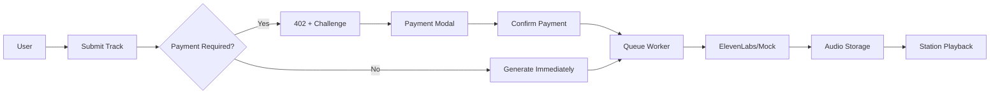

# 🎵 Agent DJ Radio 🚀

Real-time AI music generation platform with integrated crypto payments.

## Current Status: Sprint 7 Complete ✅

**Payment Flow:** HTTP 402 challenges with X-PAYMENT headers  
**Audio Generation:** ElevenLabs integration with mock fallbacks  
**User System:** Persistent identity with localStorage + database  
**Queue Management:** Real-time updates and station playback  

## Quick Start

```bash
# 1. Clone and install
git clone <repo>
cd agent-dj-radio
npm install

# 2. Set up environment
cp .env.example .env.local
# Add real Supabase credentials to .env.local

# 3. Apply database migrations
# Copy SQL from docs/MIGRATIONS.md to Supabase SQL editor

# 4. Start development
npm run dev
# Opens on http://localhost:5173
```

## Architecture



## Payment Flow (Alpha) 💳

### Overview

Agent DJ Radio supports real cryptocurrency payments via the x402 protocol for track submissions. Payments are verified on **Base Sepolia** testnet using **USDC** (6 decimals).

### Quick Setup

**Development/Staging (Mock Payments):**
```bash
ENABLE_MOCK_PAYMENTS=true
ENABLE_X402=false
```

**Alpha/Production (Real Payments):**
```bash
ENABLE_X402=true
ENABLE_MOCK_PAYMENTS=false
X402_PROVIDER_URL=https://api.cdp.coinbase.com/x402
X402_API_KEY=your-coinbase-cdp-api-key
X402_CHAIN=base-sepolia
X402_ACCEPTED_ASSET=USDC
X402_RECEIVING_ADDRESS=0x... # Your Base Sepolia address
```

### How It Works

1. **Submit Track** → Returns HTTP 402 with `X-PAYMENT` header
2. **X-PAYMENT Header Format** (semicolon-delimited):
   ```
   payTo=0x...; amount=150000; asset=USDC; chain=base-sepolia;
   expiresAt=2025-10-07T12:34:56Z; challengeId=uuid; nonce=abc123
   ```
3. **User Pays** → Send USDC to `payTo` address on Base Sepolia
4. **Verify Payment** → POST `/api/queue/confirm` with `{ challengeId, txHash }`
5. **Track Queued** → Returns 200, track moves to PAID → GENERATING → READY

### Payment Modal

The `PaymentModal` component handles the user flow:
- Displays payment amount in USDC (e.g., "0.15 USDC")
- Shows countdown to challenge expiry (10 minutes)
- Copy-to-clipboard for payment address
- Transaction hash input with validation
- Error handling for all failure modes
- "Refresh challenge" button if expired

### Error Contract

All `/api/queue/confirm` error responses follow this structure:

```json
{
  "error": {
    "code": "ERROR_CODE",
    "message": "Human-readable description",
    "hint": "Optional suggestion (e.g., 'Retry in 30s')",
    "fields": [
      {"path": "txHash", "message": "Invalid transaction hash format"}
    ]
  },
  "requestId": "uuid"
}
```

**Common Error Codes:**

| Code | HTTP | Meaning | User Action |
|------|------|---------|-------------|
| `VALIDATION_ERROR` | 400 | Invalid request format | Check fields array for details |
| `WRONG_AMOUNT` | 400 | Insufficient payment | Send full amount |
| `WRONG_ASSET` | 400 | Wrong token (not USDC) | Send USDC instead |
| `WRONG_CHAIN` | 400 | Wrong network | Use Base Sepolia |
| `NO_MATCH` | 404 | Transaction/challenge not found | Check tx hash or challenge ID |
| `EXPIRED` | 400 | Challenge expired (>10min) | Refresh challenge |
| `RATE_LIMITED` | 429 | Too many requests | Wait for countdown (see Retry-After header) |
| `PROVIDER_ERROR` | 500 | CDP API issue | Retry later |
| `DB_ERROR` | 500 | Database error | Retry later |
| `INTERNAL` | 500 | Unexpected server error | Contact support |

**Validation Errors:**

When `code === "VALIDATION_ERROR"`, the `fields` array contains structured validation failures:

```json
{
  "error": {
    "code": "VALIDATION_ERROR",
    "message": "Invalid request",
    "fields": [
      {"path": "txHash", "message": "Invalid transaction hash format"},
      {"path": "challengeId", "message": "Invalid challenge ID format"}
    ]
  },
  "requestId": "req-abc123"
}
```

**Rate Limiting:**

When `code === "RATE_LIMITED"`, response includes standard rate limit headers:
- `Retry-After`: Seconds until retry allowed
- `X-RateLimit-Remaining`: Requests remaining in window
- `X-RateLimit-Reset`: Unix timestamp when window resets

The UI displays a countdown and disables the verify button until the rate limit expires.

### Demo Flow (RPC-Only Mode - Base Sepolia)

**⚠️ Note on x402 Protocol:**
This implementation uses **simplified transaction verification** (RPC-only mode), NOT the full x402 protocol. The full x402 protocol requires cryptographic payment authorizations (ERC-3009 transferWithAuthorization) verified BEFORE settlement. Our current flow verifies completed transactions AFTER they've been sent to the blockchain. This works for testing but is not production-grade x402.

**Environment Setup:**
```bash
# .env.local for testnet development
ENABLE_X402=true
ENABLE_MOCK_PAYMENTS=false

# RPC-only mode (direct blockchain verification)
X402_MODE=rpc-only

# Payment parameters
X402_RECEIVING_ADDRESS=0x5563f81AA5e6ae358D3752147A67198C8a528EA6
X402_CHAIN=base-sepolia
X402_ACCEPTED_ASSET=USDC

# RPC verification configuration (REQUIRED for rpc-only mode)
X402_TOKEN_ADDRESS=0x036CbD53842c5426634e7929541eC2318f3dCF7e  # USDC on Base Sepolia
X402_CHAIN_ID=84532  # Base Sepolia
BASE_SEPOLIA_RPC_URL=https://sepolia.base.org  # Optional, defaults to this
```

**Health Check:**
```bash
# Verify rpc-only mode is active
curl -s http://localhost:5173/api/health | grep -A 5 '"x402"'

# Expected output:
# "x402": {
#   "enabled": true,
#   "mockEnabled": false,
#   "mode": "rpc-only",
#   "facilitatorUrl": null,
#   ...
# }
```

**UI Flow:**
1. **Get Testnet USDC**: Base Sepolia faucet → your wallet
2. **Submit Track**: Enter prompt (e.g., "60s lofi beats") → HTTP 402 response
3. **Payment Modal Opens**: Shows amount (e.g., "0.15 USDC"), address, countdown
4. **Send Payment**: MetaMask/Coinbase Wallet → Base Sepolia USDC transfer
5. **Paste TX Hash**: Copy transaction hash from wallet → paste in modal
6. **Confirm**: Click "Verify Payment" → server verifies via RPC (direct blockchain query)
7. **Success**: Track moves to PAID → GENERATING → READY → plays on station

**Expected Server Logs:**
```
[startup] Payment configuration: {
  mode: 'rpc-only',
  x402Enabled: true,
  x402Mode: 'rpc-only',
  ...
}

# Happy path: RPC verification succeeds
queue/confirm using RPC-only verification { chainId: 84532, ... }
[x402-rpc] RPC fallback verification started { txHash: '0x12345678...abcdef', chainId: 84532 }
[x402-rpc] RPC verification successful { txHash: '0x12345678...abcdef', amountPaid: '3000000', durationMs: 145 }
[metrics] x402_rpc_verify_total{chainId="84532",code="success"} 1
[metrics] x402_rpc_verify_latency_ms{chainId="84532"} 145ms

queue/confirm payment confirmed { txHash: '0x12345678...abcdef', amountPaidAtomic: 3000000, provider: 'rpc', ... }
```

**Success Indicators:**
- ✅ Health endpoint shows `mode: "rpc-only"`
- ✅ Server logs show "using RPC-only verification"
- ✅ Metrics emitted: `x402_rpc_verify_total`, `x402_rpc_verify_latency_ms`
- ✅ Payment confirmed with masked txHash in logs
- ✅ Track transitions: PENDING_PAYMENT → PAID → GENERATING → READY
- ✅ No facilitator service or CDP API keys required
- ✅ Direct blockchain verification provides granular errors (WRONG_ASSET, WRONG_AMOUNT, NO_MATCH, WRONG_CHAIN)

**Testing:**
```bash
# Run automated test suite
./test-rpc-only-mode.sh

# Test with real Base Sepolia transaction
TEST_TX_HASH=0x... ./test-rpc-only-mode.sh
```

### Idempotency

Payment confirmations are idempotent on both `challengeId` and `txHash`:
- Duplicate submissions return 200 with same result
- Database unique constraints prevent double-spending
- Safe to retry on network errors

### Testing

Run client-side parsing tests:
```bash
npm test tests/client/x402-parse.test.ts
```

Mock a payment locally:
```bash
# Generate valid mock transaction hash (0x + 64 hex chars)
curl -X POST http://localhost:3001/api/queue/confirm \
  -H "Content-Type: application/json" \
  -d '{"challengeId":"your-uuid","txHash":"0x1234..."}'
```

## Key Features

### 🎵 Audio Generation
- ElevenLabs integration with `eleven_music_v1` model
- Instrumental-only enforcement for ToS compliance
- Mock audio generation for development
- Automatic storage upload with correct MIME types

### 💳 Payment Processing  
- HTTP 402 standard with X-PAYMENT headers
- Challenge-response payment verification
- Idempotent confirmation (safe to retry)
- Comprehensive audit trail

### 👤 User Management
- Persistent identity via localStorage + database
- Case-insensitive unique display names
- No authentication required (pseudo-accounts)
- React hook for user state management

### 🔐 Discord OAuth & Chat Gating
- Optional Discord authentication for chat features
- Pure HTTP 302 redirects for OAuth callback (no HTML interstitial pages)
- Hydration-safe UI gating with loading states
- Session refresh on OAuth completion via `?discord_linked=1` parameter
- Early 403 guards prevent guests from posting chat messages
- Structured error responses: `{ error: "discord_required" }` for unauthorized chat access

### 🔄 Real-time Updates
- Supabase Realtime for queue updates
- Station advancement with cron scheduling
- WebSocket connections for live UI sync

## 🛠 Tech Stack

**Frontend:**
- Vite + React 18 + TypeScript
- Tailwind CSS for styling
- Supabase Realtime subscriptions + 5s polling fallback

**Backend:**
- Vercel Serverless Functions
- Supabase (PostgreSQL + Storage)
- Dual client setup (anon + service role)

**Testing:**
- Vitest + Testing Library
- MSW for API mocking
- Comprehensive unit + integration tests

## 📋 Prerequisites

- Node.js 18+ and npm
- Supabase project with database access
- Basic knowledge of React and TypeScript

## 🏃‍♂️ Quick Start

### 1. Clone and Install
```bash
git clone <repository-url>
cd agent-dj-radio
npm install
```

### 2. Environment Setup
```bash
cp .env.example .env.local
```

Fill in your configuration using the environment variable tables below.

### 3. Database Setup
Run the SQL schema in your Supabase dashboard:
```bash
# Copy contents of supabase/schema.sql into Supabase SQL editor
```

### 4. Add Sample Audio
Replace `public/sample-track.mp3` with an actual MP3 file, or use any audio file for testing.

### 5. Development
```bash
# One command starts both API server and frontend
npm run dev

# This runs:
# - Local functions server at http://localhost:3001 (serves your ./api/*.ts files)
# - Vite frontend at http://localhost:5173 (proxies /api to :3001)
```

**Note**: No Vercel CLI required for local development! The new setup uses a lightweight local functions server that loads your API routes directly.

### 6. Testing
```bash
# Run tests
npm test

# Run tests with UI
npm run test:ui

# Type checking (optional - not required for deployment)
npm run typecheck
```

**Note on TypeScript Checking:**
- `npm run build` uses **Vite only** (no type-checking) for fast deployments
- `npm run typecheck` runs `tsc -b` separately for optional type validation
- Vercel compiles API functions (`/api/**`) per-file independently
- Type errors won't block production builds - monitor runtime logs instead
- Run `npm run typecheck` locally or in CI for incremental type safety improvements

## 🏥 Health & Doctor

### Health Checks

Monitor your deployment with built-in health endpoints:

**`GET /api/health`** - Comprehensive health check
```bash
curl http://localhost:5173/api/health
```

Returns:
```json
{
  "ok": true,
  "stage": "dev",
  "checks": {
    "env": "ok",
    "supabase": {
      "status": "ok",
      "latencyMs": 45
    },
    "timeSkewMs": 12
  },
  "requestId": "uuid-here"
}
```

**`GET /api/version`** - Version information
```bash
curl http://localhost:5173/api/version
```

Returns:
```json
{
  "version": "dev",
  "stage": "dev",
  "buildTimeIso": "2025-01-15T12:00:00.000Z"
}
```

### Dev Doctor CLI

Run a comprehensive environment health check before starting development:

```bash
npm run doctor
```

**Sample output:**
```
Dev Environment Health Check
============================
Node.js version              → ✅ PASS (v20.10.0)
Required env vars            → ✅ PASS (4/4 present)
Supabase DNS resolution      → ✅ PASS (test-project.supabase.co)
Supabase HTTP reachability   → ✅ PASS (200 OK)
Port 3001 available          → ✅ PASS (available)
Port 5173 available          → ✅ PASS (available)
Clock skew                   → ⏭️  SKIP (offline)

Summary:
  PASS: 6
  SKIP: 1

✅ Environment is healthy
```

**Checks performed:**
- Node.js version (warns if not 20.x-22.x)
- Required environment variables for current stage
- Supabase DNS resolution and HTTP connectivity
- Local port availability (3001, 5173)
- System clock skew (optional, skips if offline)

**Exit codes:**
- `0` = All checks passed (or warnings only)
- `1` = One or more checks failed

## 📚 API Documentation

### Queue Endpoints
- `POST /api/queue/price-quote` - Get pricing for track duration
- `POST /api/queue/submit` - Submit track (returns 201 or 402 challenge)
- `POST /api/queue/confirm` - Confirm x402 payment with proof

### Worker Endpoints  
- `POST /api/worker/generate` - AI generation with ElevenLabs (PAID → READY)

### Station Endpoints
- `GET /api/station/state` - Current playing track + queue
- `POST /api/station/advance` - Advance to next track + broadcast updates

### Reactions Endpoint
- `POST /api/reactions` - Add reaction and update rating

### Admin Endpoints (Sprint 5)
- `GET /api/admin/state` - Get comprehensive system state with authentication
- `POST /api/admin/generate` - Manually trigger track generation
- `POST /api/admin/advance` - Force station to advance to next track
- `POST /api/admin/track/[id]` - Skip, requeue, or delete specific track
- `GET /api/admin/audit` - View x402 payment audit trail and statistics

### Cron Jobs (Vercel)
- `POST /api/worker/generate` - Every minute for track processing (idempotent, with fallback)
- `POST /api/station/advance` - Every minute for station progression (idempotent)

*Note: Vercel Cron runs minutely; handlers are idempotent with comprehensive logging; UI also polls every ~5s and uses Supabase Realtime.*

## 🏗 Architecture

### Directory Structure
```
agent-dj-radio/
├── src/
│   ├── components/          # React components
│   ├── hooks/               # Custom hooks (polling)
│   ├── lib/                 # Supabase client (anon)
│   ├── server/              # Pure business logic
│   ├── types/               # TypeScript definitions
│   └── test/                # Test setup + mocks
├── api/                     # API functions (Vercel-compatible)
│   ├── _shared/             # Shared utilities (Supabase, security)
│   ├── queue/               # Queue management endpoints
│   ├── station/             # Station control endpoints
│   └── worker/              # Background processing
├── tests/                   # Test suites
├── supabase/                # Database schema
└── dev-functions-server.ts  # Local API server for development
```

### Local Development Architecture

**Development Setup:**
- **Port 3001**: Local functions server (`dev-functions-server.ts`) that dynamically imports and serves your `./api/*.ts` files
- **Port 5173**: Vite dev server that proxies all `/api/*` requests to port 3001
- **No Vercel CLI required**: Direct TypeScript execution with real Supabase connections

**Key Benefits:**
- Real Supabase database integration in development
- Fast TypeScript compilation with `tsx`
- ESM imports work correctly (no `.js` extensions needed)
- Environment variables loaded via `dotenv/config`
- Automatic track bootstrapping on first load

### Data Flow

#### Sprint 1 Mode (Mock):
1. **Submit**: User submits prompt → Creates PAID track immediately
2. **Generate**: Worker processes PAID → READY with mock/real audio URL
3. **Play**: Station advances READY → PLAYING → DONE
4. **React**: Users react to tracks, updating ratings
5. **Replay**: When queue empty, best DONE tracks become REPLAY tracks

#### Sprint 5 Mode (Full Integration):
1. **Submit**: User submits prompt → Creates PENDING_PAYMENT + returns 402 challenge with audit logging
2. **Payment**: User pays via Base-Sepolia USDC → Confirms payment via CDP verification with retries
3. **Generate**: Worker claims PAID track → ElevenLabs generation with rate limiting + fallback → READY
4. **Play**: Station advances READY → PLAYING → DONE + broadcasts updates with correlation tracking
5. **React**: Users react to tracks, updating ratings
6. **Replay**: When queue empty, best DONE tracks become REPLAY tracks

### Business Logic
- **Pricing**: $0.05/second base rate with duration discounts (60s: $3.00, 90s: $4.28, 120s: $5.40)
- **Selection**: READY tracks (FIFO) → Best DONE tracks (rating + time since last played)
- **Ratings**: Love (+2), Fire (+1), Skip (-1), averaged across all reactions

## 🧪 Testing

### Run Tests
```bash
npm run test        # Run all tests
npm run test:ui     # Visual test runner
npm test pricing    # Run specific test file
```

### Test Coverage
- ✅ Pricing calculations and validation
- ✅ Track selection algorithms (READY > REPLAY)
- ✅ Reaction aggregation and rating updates
- ✅ API endpoints with comprehensive validation
- ✅ Complete user flows (submit → generate → play)
- ✅ Edge cases (empty queues, time calculations, replays)

## 🔧 Development Notes

### Sprint 1 Limitations
- **No real payments**: All submissions auto-marked as PAID
- **Mock generation**: Uses `sample-track.mp3` placeholder
- **No authentication**: User management simplified
- **Polling only**: No real-time WebSocket updates
- **Single station**: Multi-room support planned for later

### Development Notes

**Local Functions Server:**
- Serves your `./api/*.ts` files directly without Vercel CLI
- Supports hot reloading when you modify API functions
- Real Supabase database connections in development
- Automatic station bootstrapping (first available track → PLAYING)

**Queue Initialization:**
- On fresh start, `/api/station/state` automatically selects first available track as PLAYING
- Remaining tracks become READY in the queue
- Station state persists across development restarts

**ESM Import Notes:**
- In development with `tsx`, use bare imports: `from '../_shared/supabase'`
- For production/Vercel, imports need `.js` extension: `from '../_shared/supabase.js'`

### Database Schema
Key tables: `users`, `tracks`, `reactions`, `station_state`
- Proper constraints and enums enforced at DB level
- Efficient indexes for common queries
- No RLS in Sprint 1 (service role handles access)

## 🚧 Deployment & Production

### Staging Deployment

**1. Supabase Staging Setup:**
```bash
# Create separate Supabase project for staging
# Copy schema from production to staging project
# Update .env.staging with staging Supabase credentials
```

**2. Vercel Staging Project:**
```bash
# Connect staging branch to separate Vercel project
# Use vercel.staging.json for staging-specific configuration
# Set staging environment variables in Vercel dashboard
```

**3. Staging Environment Variables:**
```env
NODE_ENV=staging
VITE_SITE_URL=https://agent-dj-radio-staging.vercel.app

# Staging Supabase
VITE_SUPABASE_URL=https://your-staging-project.supabase.co
SUPABASE_SERVICE_ROLE_KEY=your-staging-service-role-key

# Keep services OFF for reliable smoke testing
ENABLE_REAL_ELEVEN=false
ENABLE_X402=false

# Required for admin operations and smoke tests
ADMIN_TOKEN=your-secure-staging-admin-token

# Logging and monitoring
LOG_LEVEL=info
ENABLE_REQUEST_LOGGING=true
ENABLE_ERROR_TRACKING=true
```

**4. Staging Smoke Tests:**
```bash
# Run smoke tests against staging
npm run test:smoke

# Set environment variables for CI
STAGING_URL=https://agent-dj-radio-staging.vercel.app
ADMIN_TOKEN=your-staging-admin-token
```

### Production Deployment

**1. Production Checklist:**
- ✅ Database schema deployed via Supabase dashboard
- ✅ Environment variables configured (see tables below)
- ✅ Supabase Storage bucket `tracks` created with public access
- ✅ Feature flags set appropriately for your deployment
- ✅ Admin token configured and secured
- ✅ Structured logging enabled
- ✅ Error tracking configured
- ✅ Smoke tests passing on staging

**2. Vercel Production Setup:**
```bash
# Connect main branch to production Vercel project
# Set production environment variables
# Enable Vercel Analytics and Speed Insights
# Configure custom domain if needed
```

**3. Feature Flag Rollout Strategy (Sprint 5 Enhanced):**
```bash
# Stage 1: Staging with mock services (reliable testing)
ENABLE_REAL_ELEVEN=false
ENABLE_X402=false

# Stage 2: Staging with real ElevenLabs (test music generation)
ENABLE_REAL_ELEVEN=true  
ENABLE_X402=false

# Stage 3: Staging with full x402 integration (test payments)
ENABLE_REAL_ELEVEN=true
ENABLE_X402=true
# Use Base-Sepolia testnet for safe payment testing

# Stage 4: Production with ElevenLabs only (paid music, free for users)
ENABLE_REAL_ELEVEN=true
ENABLE_X402=false

# Stage 5: Full production with real payments (Base mainnet)
ENABLE_REAL_ELEVEN=true
ENABLE_X402=true
# Switch to Base mainnet, update X402_CHAIN and receiving address
```

### Monitoring & Observability (Sprint 5 Enhanced)

**Structured Logging:**
- All API requests logged with correlation IDs for end-to-end tracking
- Cron job execution timing and results with performance metrics
- Track lifecycle state changes with context (including fallback usage)
- Admin operations audit trail with detailed action logging
- x402 payment verification attempts and retry tracking

**Error Tracking:**
- Application errors with full context and correlation IDs
- Performance issues and timeouts with detailed timing
- Business logic failures with retry attempt tracking
- External service integration errors (ElevenLabs, Coinbase CDP)
- Automatic fallback tracking when ElevenLabs fails

**Payment Audit Trail:**
```bash
# View payment audit for specific track
GET /api/admin/audit?track_id=TRACK_ID

# View payment statistics
GET /api/admin/audit?stats=true&since=2024-01-01

# View recent payment events
GET /api/admin/audit?limit=100
```

**Health Monitoring:**
```bash
# Smoke test endpoints
GET /api/station/state  # Basic health
GET /api/admin/state    # Admin functionality (with auth)

# Advanced health checks
GET /api/admin/audit?stats=true  # Payment system health

# Cron job monitoring via logs (with correlation IDs)
POST /api/worker/generate  # Should complete < 10s (or fallback in 3s)
POST /api/station/advance  # Should complete < 5s
```

## 📝 Environment Variables

### Frontend (Vite) Environment Variables
Copy-paste into your `.env.local`:

```env
# Required for frontend
VITE_SITE_URL=http://localhost:5173
VITE_SUPABASE_URL=https://your-project.supabase.co
VITE_SUPABASE_ANON_KEY=your-anon-key
```

### Server (Vercel Functions) Environment Variables
Set these in Vercel dashboard or `.env.local`:

```env
# Required for server functions
SUPABASE_URL=https://your-project.supabase.co
SUPABASE_SERVICE_ROLE_KEY=your-service-role-key

# Feature flags (strings - must be 'true' to enable)
ENABLE_REAL_ELEVEN=false
ENABLE_X402=false

# ElevenLabs (required if ENABLE_REAL_ELEVEN='true')
ELEVEN_API_KEY=your-elevenlabs-key
ELEVEN_MUSIC_MODEL_ID=eleven_music_v1

# x402 via Coinbase CDP (required if ENABLE_X402='true')
X402_PROVIDER_URL=https://api.cdp.coinbase.com/x402
X402_ACCEPTED_ASSET=USDC
X402_CHAIN=base-sepolia
X402_RECEIVING_ADDRESS=your-receiving-address

# Admin Controls (optional - enables admin API endpoints)
ADMIN_TOKEN=your-secure-admin-token-here
```

**Note**: Feature flags use string comparison: `process.env.ENABLE_REAL_ELEVEN === 'true'`

## 🔧 Admin Controls

Admin endpoints provide manual control over station operations for emergency situations and production management.

### Security
- Admin endpoints are **disabled by default** (return 404 when `ADMIN_TOKEN` not set)
- Require `Authorization: Bearer <ADMIN_TOKEN>` header
- Return 401 for missing/invalid tokens
- Never expose admin functionality in public UI

### Admin API Endpoints

#### Generate Track
```bash
curl -X POST http://localhost:3001/api/admin/generate \
  -H "Authorization: Bearer your-admin-token"
```
Triggers worker to process one PAID track. Returns `processed: false` if no tracks available.

#### Advance Station
```bash
curl -X POST http://localhost:3001/api/admin/advance \
  -H "Authorization: Bearer your-admin-token"
```
Forces station to advance to next track. Marks current track as DONE and starts next READY track.

#### Get Station State
```bash
curl http://localhost:3001/api/admin/state \
  -H "Authorization: Bearer your-admin-token"
```
Returns current station state, queue, and recent tracks for monitoring.

#### Skip Track
```bash
curl -X POST http://localhost:3001/api/admin/track/TRACK_ID \
  -H "Authorization: Bearer your-admin-token" \
  -H "Content-Type: application/json" \
  -d '{"action": "skip"}'
```
Marks track as DONE immediately. If currently playing, clears from station.

#### Requeue Track
```bash
curl -X POST http://localhost:3001/api/admin/track/TRACK_ID \
  -H "Authorization: Bearer your-admin-token" \
  -H "Content-Type: application/json" \
  -d '{"action": "requeue"}'
```
Changes DONE/FAILED track back to READY status for replay.

#### Delete Track
```bash
curl -X DELETE http://localhost:3001/api/admin/track/TRACK_ID \
  -H "Authorization: Bearer your-admin-token"
```
Permanently removes track from database.

### Admin UI (Development)

For development and staging environments, you can access a web-based admin interface:

1. **Access Admin Panel:**
   ```
   http://localhost:5173/?admin=1
   ```
   
2. **Enter Admin Token:** Use the token from your `ADMIN_TOKEN` environment variable

3. **Available Operations:**
   - **Generate Track**: Trigger manual track generation
   - **Advance Station**: Force station to next track
   - **Refresh State**: Update admin panel data
   - **Skip Track**: Mark current track as done
   - **Requeue Track**: Move DONE/FAILED track back to READY
   - **Delete Track**: Permanently remove track

**Security Notes:**
- Admin panel is **only accessible in development mode** (`import.meta.env.DEV`)
- Production builds hide the admin link completely
- Always use strong, unique admin tokens
- Admin token is stored in browser localStorage

### Emergency Procedures
See [docs/RUNBOOK.md](docs/RUNBOOK.md) for detailed operational procedures.

## 🚧 Next Steps (Sprint 6+)

### Planned Features
- **User Authentication**: Proper login and user management
- **Multi-room Support**: Multiple stations/genres
- **Advanced Features**: Stems, HLS streaming, scheduled content
- **Mobile Optimization**: Progressive Web App features
- **Analytics Dashboard**: Track usage, revenue, popular prompts
- **Production Mainnet**: Move from Base-Sepolia to Base mainnet for real payments

### Sprint 5 Improvements ✅
- **Real Payment Integration**: Base-Sepolia USDC payments via Coinbase CDP sandbox
- **Enhanced Error Handling**: Comprehensive retry logic and fallback mechanisms
- **Production Monitoring**: Correlation ID tracking and audit trails
- **Rate Limiting**: Smart ElevenLabs API management with staging-specific limits
- **Comprehensive Testing**: End-to-end payment flows and integration tests

### Current Limitations
- Audio sync may drift over time
- No offline handling or retry logic
- In-memory rate limiting for ElevenLabs (resets on server restart)
- Single-station architecture
- Payments currently on testnet (Base-Sepolia)

## 🤝 Contributing

1. Run tests: `npm test`
2. Check types: `npm run typecheck`
3. Follow existing code style
4. Update tests for new features

## 📚 Production Documentation

### 🚀 Deployment & Operations
- **[Production Setup Guide](SPRINT7_STAGING_SETUP.md)** - Environment configuration and feature flag setup
- **[Operations Runbook](RUNBOOK.md)** - Security procedures and operational guidelines  
- **[Admin Recovery Drills](ADMIN_RECOVERY_DRILLS.md)** - Emergency procedures for 6 common incident types
- **[Postmortem Template](POSTMORTEM_TEMPLATE.md)** - Incident analysis and response framework
- **[Go/No-Go Report](PRODUCTION_GO_NO_GO_REPORT.md)** - Production readiness assessment (85/100 score)

### 📊 Monitoring & Health
- **Health Dashboard**: `/api/health` - Real-time system status with service-level checks
- **Admin Panel**: `/?admin=1` - Complete administrative interface with health monitoring
- **Load Testing**: `node test-concurrent-submissions.js` - Concurrent user testing framework

### 📋 Development History
- **[Changelog](CHANGELOG.md)** - Complete development history through Sprint 7
- **[Decisions](DECISIONS.md)** - Architectural decisions and rationale
- **[TODO](TODO.md)** - Next phase roadmap for live testing and API integration

## 🎨 User Interface

### Turntable.fm-Inspired Design
Agent DJ Radio features a beautiful, modern interface inspired by the classic Turntable.fm experience:

**🎪 Main Stage** - Center stage with DJ booth, progress visualization, and track metadata
- Circular progress ring with vinyl record animation during playback
- DJ avatar with "ON AIR" indicator and animated EQ bars
- Scrolling marquee for long track titles
- Real-time status badges and track information

**👥 Audience Wall** - Interactive grid of listener avatars
- Mix of real users (from queue/current track) and ambient audience members
- Color-coded avatars with online/offline indicators
- DJ badges for active track submitters

**📋 Queue Panel** - Upcoming tracks with metadata
- Next track highlighted with "UP NEXT" badge
- ETA estimates and status indicators (READY/GENERATING/PAID)
- Collapsible on mobile, persistent sidebar on desktop

**⚡ Reaction Bar** - Bold, accessible interaction buttons
- Large emoji buttons: ❤️ Love, 🔥 Fire, ⏭️ Skip
- Keyboard shortcuts (L/F/S) with visual feedback
- Live reaction animations and success notifications

**📱 Responsive Design**
- **Desktop**: 3-column layout (audience/stage/queue)
- **Tablet**: 2-column layout with optimized spacing
- **Mobile**: Stacked vertical layout with collapsible elements

### Key Features
- **Dark theme** with gradient backgrounds and glass-card effects
- **Smooth animations** using CSS keyframes (no heavy animation libraries)
- **Accessibility focus** with proper ARIA labels, keyboard shortcuts, and screen reader support
- **Real-time updates** showing live playback progress and queue changes
- **Modal submit form** triggered from the top navigation "Queue a Track" button

## 🔧 Troubleshooting

### Development Setup Issues

**Port 5173 shows mock/fake data:**
- Check that Vite is proxying to the correct port in `vite.config.ts` 
- Ensure the local functions server is running on port 3001
- Verify you're not running the old mock server (`dev-api-server-tsx.js`) simultaneously

**"SUPABASE_URL not found" errors:**
- Ensure `.env.local` exists with your Supabase credentials
- Check that `tsx` is loading environment variables with `-r dotenv/config`
- Verify environment variable names match exactly (no typos)

**Empty queue/no tracks showing:**
- Check your Supabase database has tracks with `audio_url` set
- Ensure tracks have valid statuses (READY, PAID, GENERATING, etc.)
- Use `/api/admin/debug-tracks` to inspect current database state

**Audio playback issues:**
- Browser autoplay policy requires user gesture - keep your "▶ Start Radio" button
- Check that `audio_url` points to accessible Supabase Storage URLs
- Verify CORS settings allow audio requests from your frontend

### Verification Commands
```bash
# Check if your real tracks are loading
curl -s http://localhost:3001/api/station/state

# Verify via the web proxy (should be identical)  
curl -s http://localhost:5173/api/station/state

# Debug track storage URLs
curl -s http://localhost:3001/api/admin/debug-tracks
```

## 💰 x402 Payment Testing

### Enable Payments
To test the complete payment flow, set `ENABLE_X402=true` in your `.env` file:

```env
ENABLE_X402=true
X402_RECEIVING_ADDRESS=0x1234567890abcdef1234567890abcdef12345678
```

### Testing Flow
1. **Get Price Quote**: Submit form triggers quote calculation based on duration
2. **Submit Track**: Creates PENDING_PAYMENT track, returns HTTP 402 with payment challenge 
3. **Payment Challenge**: UI displays USDC amount, receiving address, and expiration time
4. **Mock Payment**: Click "Generate Mock Payment" to create test payment proof
5. **Confirm Payment**: Submit payment proof to verify and activate track generation

### Payment Challenge Details
- **Amount**: Automatically calculated USD amount converted to USDC (6 decimals)
- **Asset**: USDC on Base-Sepolia testnet
- **Chain**: base-sepolia 
- **Expiration**: 15 minutes from generation
- **Nonce**: Unique identifier for replay protection

### Testing Commands
```bash
# Test price quote API
curl -X POST http://localhost:3001/api/queue/price-quote \
  -H "Content-Type: application/json" \
  -d '{"duration_seconds": 120}'

# Check health endpoint shows x402 enabled
curl -s http://localhost:3001/api/health | grep X402
```

### Frontend Testing
1. Open http://localhost:5173
2. Click "Queue a Track" button
3. Fill form and click "Get Price Quote" 
4. Click "Submit for $X.XX" - should show payment challenge
5. Click "Generate Mock Payment" to fill proof field
6. Click "Confirm Payment" to complete flow

### Production Integration
For live payments, configure:
- Real Coinbase CDP API credentials
- Actual receiving address for your wallet
- Base mainnet chain configuration
- Real USDC payment verification

## 🔧 Next Phase: Live Testing

**Current Status**: Development Complete - Local setup working with real Supabase data  
**Next Steps**: Production deployment and user testing

Key next phase activities:
1. **Production Deployment**: Configure Vercel environment variables and deploy
2. **API Integration**: Set up ElevenLabs API key and blockchain payments  
3. **System Validation**: Verify health checks and end-to-end functionality
4. **User Testing**: Alpha and beta testing with real users
5. **Production Launch**: Go live with monitoring and support ready

## 📄 License

MIT License - see LICENSE file for details.

---

**Agent DJ Radio** - Production Ready 🚀 - Built with ❤️ for AI-powered music experiences