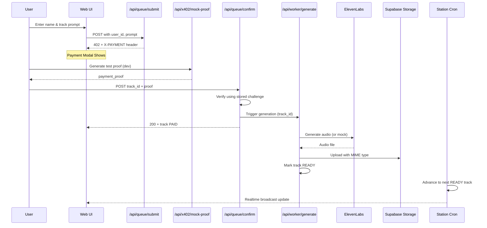
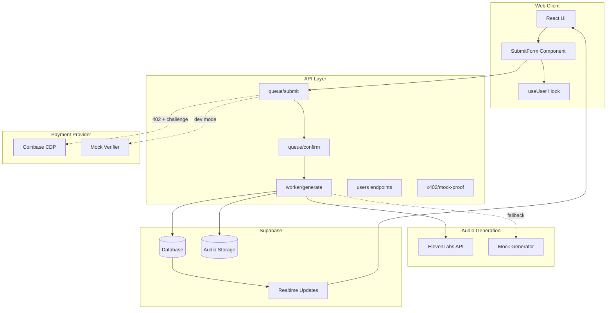

# Architecture Overview

Agent DJ Radio is a real-time music generation platform with integrated payment processing.

## System Flow

## Component Architecture

## Data Flow

1. **User Creation**: Persistent identity via localStorage + database lookup
2. **Payment Challenge**: Submit creates PENDING_PAYMENT track with x402 challenge
3. **Proof Verification**: Confirm validates against stored challenge, marks PAID
4. **Generation Pipeline**: Worker claims PAID track, generates audio, uploads to storage
5. **Station Playback**: Cron advances through READY tracks with realtime UI updates

## Key Design Decisions

**Payment-First Architecture**: Tracks created in PENDING_PAYMENT state, only advance after verification
**Idempotent Operations**: Confirm endpoint safe to retry, worker handles concurrent claims
**Instrumental Enforcement**: Prompts filtered for ElevenLabs ToS compliance
**Mock-First Development**: All external services have mock implementations for testing